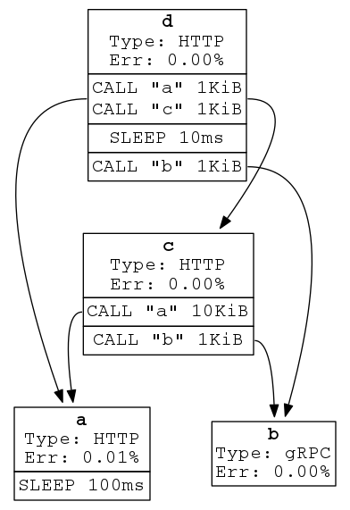

# Isotope

Isotope (**is**ti**o** **to**pology **pe**rformance) benchmarks Istio against
various service graph topologies.

# Repository Structure

| Item                          | Role                                              |
|-------------------------------|---------------------------------------------------|
| example-topologies/           | Examples of topology configurations               |
| [convert/](convert/README.md) | Go command to convert topologies to other formats |
| [service/](service/README.md) | Go command to run as a node in the service graph  |
| run_tests.py                  | CLI to run tests against topologies               |
| [runner/](runner/README.md)   | Python module used by `run_tests.py`              |
| create_tree_topology.py       | Python script to create a hierarchical topology   |

# Topology Converter

The topology converter, located under the convert/ direcory, is a Go Utility for simulating real world microservice topologies in Kubernetes.  The converter accepts a yaml file which describes one or more microservices as a workflow graph (ie service A waits 100 ms, then calls services B and C in paralell, each of which return a 1MB payload, etc).  `converter kubernetes` processes a yaml file, producing kubernetes manifests, as described below.  `converter graphviz` produces a visualization of your microservice architecture specified in service-graph.yaml.

## service-graph.yaml

Describes a service graph to be tested which mocks a real world service-oriented
architecture.

### Specification

```yaml
apiVersion: {{ Version }} # Required. K8s-like API version.
kind: MockServiceGraph
default: # Optional. Default to empty map.
  type: {{ "http" | "grpc" }} # Optional. Default "http".
  errorRate: {{ Percentage }} # Optional. Default 0%.
  requestSize: {{ ByteSize }} # Optional. Default 0.
  responseSize: {{ ByteSize }} # Optional. Default 0.
  script: {{ Script }} # Optional. See below for spec.
  numRbacPolicies: {{ Int }} # Optional. Number of RBAC policies generated per service. Default 0.
services: # Required. List of services in the graph.
- name: {{ ServiceName }}: # Required. Name of the service.
  type: {{ "http" | "grpc" }} # Optional. Default "http".
  responseSize: {{ ByteSize }} # Optional. Default 0.
  errorRate: {{ Percentage }} # Optional. Overrides default.
  script: {{ Script }} # Optional. See below for spec.
  numRbacPolicies: {{ Int }} # Optional. Number of RBAC policies generated per service, overrides the default numRbacPolicies.
```

#### Default

At the global scope a `default` map may be placed to indicate settings which
should hold for omitted settings for its current and nested scopes.

Default-able settings include `type`, `script`, `responseSize`,
`requestSize`, `errorRate` and `numRbacPolicies`.

##### Example

```yaml
apiVersion: v1alpha1
default:
  errorRate: 0.1%
  requestSize: 100KB
  # responseSize: 0 # Inherited from default.
  # type: "http" # Inherited from default.
  # script: [] # Inherited from default (acts like an echo server).
  # numRbacPolicies: 0 # Inherited from default.
services:
- name: a
  memoryUsage: 80%
  script:
  - call: b # payloadSize: 100KB # Inherited from default.
  - call:
      service: b
      payloadSize: 80B
  # computeUsage: 10% # Inherited from default.
  # errorRate: 10% # Inherited from default.
- name: b
  errorRate: 5%
  # computeUsage: 10% # Inherited from default.
  # memoryUsage: 0% # Inherited from default.
  # script: [] # Inherited from default.
```

#### Script

`script` is a list of high level steps which run when the service is called.

Each step is executed sequentially and may contain either a single command or
a list of commands. If the step is a list of commands, each command in that
sub-list is executed concurrently (this effect is not recursive; there may
only be one level of nested lists).

The script is always _started when the service is called_ and _ends by
responding to the calling service_.

##### Commands

Each step in the script includes a command.

###### Sleep

`sleep`: Pauses for a duration. Useful for simulating processing time.

One can pass a static value, a histogram, or a probability distribution.

##### Examples

Each request would pause for 10ms

```yaml
sleep: {type: "static", data: {time: "10ms"}}
```

50\% of the request would pause for 50ms and the other 50\% would 
pause for 100ms.

```yaml
sleep: {type: "histogram", data: {"50ms": 50, "100ms": 50}}
```

Each request's pause duration would follow a Normal Random Variable
with mean 1.0 and stdev 0.25

```yaml
sleep: {type: "dist", data: {"dist": "normal", "mean": 1.0, "sigma": 0.25}}
```

###### Send Request

`call`: Sends a HTTP/gRPC request (depending on the receiving service's type)
to another service.

```yaml
call: {{ ServiceName }}
```

OR

```yaml
call:
  service: {{ ServiceName }}
  payloadSize: {{ ByteSize (e.g. 1 KB) }}
```

##### Examples

Call A, then call B _sequentially_:

```yaml
script:
- call: A
- call: B
```

Call A, B, and C _concurrently_, sleep to simulate work, and finally call D:

```yaml
script:
- - call: A
  - call: B
  - call: C
- sleep: 10ms
- call: D
```


### Full example

```yaml
apiVersion: v1alpha1
kind: MockServiceGraph
defaults:
  type: grpc
  requestSize: 1 KB
  responseSize: 16 KB
services:
- name: a
  errorRate: 0.01%
  script:
  - sleep: 100ms
- name: b
  type: grpc
- name: c
  script:
  - call:
      service: a
      size: 10K
  - call: b
- name: d
  script:
  - - call: a
    - call: c
  - sleep: 10ms
  - call: b
```

Represents a service graph like:



Generates a Kubernetes manifest like:

```yaml
apiVersion: v1
kind: ConfigMap
metadata:
  name: scripts
data:
  a: |
    errorRate: 0.0001
    name: a
    responseSize: 16KiB
    script:
    - sleep: 100ms
    type: http
  b: |
    name: b
    responseSize: 16KiB
    type: grpc
  c: |
    name: c
    responseSize: 16KiB
    script:
    - call:
        service: a
        size: 10KiB
    - call:
        service: b
        size: 1KiB
    type: http
  d: |
    name: d
    responseSize: 16KiB
    script:
    - - call:
          service: a
          size: 1KiB
      - call:
          service: c
          size: 1KiB
    - sleep: 10ms
    - call:
        service: b
        size: 1KiB
    type: http
---
apiVersion: v1
kind: Service
metadata:
  name: a
---
apiVersion: apps/v1
kind: Deployment
metadata:
  name: a
spec:
  template:
    spec:
      containers:
      - name: performance-test
        image: istio.gcr.io/performance-test
---
apiVersion: v1
kind: Service
metadata:
  name: b
---
apiVersion: apps/v1
kind: Deployment
metadata:
  name: b
spec:
  template:
    spec:
      containers:
      - name: performance-test
        image: istio.gcr.io/performance-test
---
apiVersion: v1
kind: Service
metadata:
  name: c
---
apiVersion: apps/v1
kind: Deployment
metadata:
  name: c
spec:
  template:
    spec:
      containers:
      - name: performance-test
        image: istio.gcr.io/performance-test
---
apiVersion: v1
kind: Service
metadata:
  name: d
---
apiVersion: apps/v1
kind: Deployment
metadata:
  name: d
spec:
  template:
    spec:
      containers:
      - name: performance-test
        image: istio.gcr.io/performance-test
---
```

# Test Runner

The test runner is a python script which automates the running of tests against service-graph.yaml on GKE.  It expects a test config file, and sets up a GKE cluster with the specified resources to run configured tests against the requested topology, using each of the environments (Istio, Raw K8s, etc) listed in the test config.  See [example-config.toml](example-config.toml) for more details.  The Test Runner is at an alpha level of readiness, and may require updating based on your environment.

## Getting Started

To run automatic tests in "run_tests.py" and from "runner/", there are
dependencies that must be installed.

1. Clone istio/tools
1. From the repository root, run `dep ensure`
1. Install python3
1. Install pip3
1. From "isotope/", run `pip3 install -r runner/requirements.txt`
1. Install gcloud
1. Install kubectl >= 1.9.7
1. Install helm >= 2.8.2
1. Create a PersistentDisk in GCP named "prometheus-pd" with 1000 GB (this
   matches "runner/resources/persistent-volume.yaml")
1. Modify "example-config.toml" to match your desired test configuration
1. From "isotope/", run `./run_tests.py example-config.toml`


## Prometheus Metrics

The system deploys a Prometheus instance to collect and label metrics
throughout the tests. The current implementation connects it to a [Persistent
Volume](https://kubernetes.io/docs/concepts/storage/persistent-volumes/) to
write to a [Persistent Disk](https://cloud.google.com/compute/docs/disks/).
This ensures the data is not lost when the Prometheus instance is deleted.

However, so long as you adhere to calling the "/metrics" HTTP endpoints,
metrics could be collected by other means.

