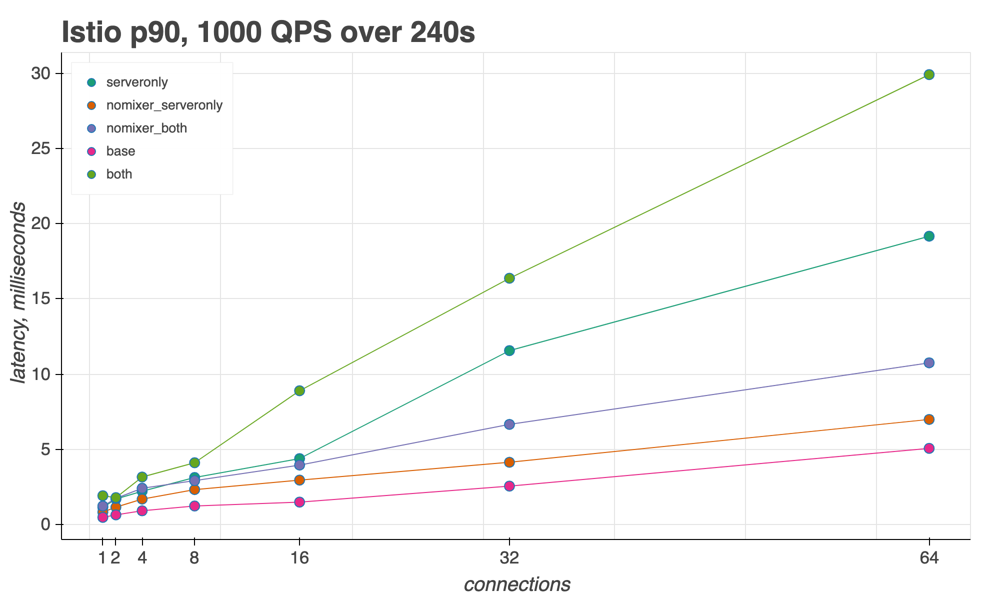

# Istio Performance Benchmarking

This directory contains Python scripts to benchmark Istio's data plane performance.

See the [Istio Performance and Scalability Guide](https://istio.io/docs/concepts/performance-and-scalability/) for performance data against the latest Istio release.

For instructions on how to run these scripts with Linkerd, see the [linkerd/](linkerd/) directory.

## Prerequisites

1. [Python3](https://docs.python-guide.org/starting/installation/#installation-guides)
1. [`pipenv`](https://docs.python-guide.org/dev/virtualenvs/#virtualenvironments-ref)
1. [helm](https://helm.sh/docs/using_helm/#install-helm)

## Setup

1. Create a Kubernetes cluster. We provide a GKE cluster-create script in this repo.
**Note**: The CPU requirement is very high, you may need to update your quota accordingly. If you are using your own cluster, see the install [README](https://github.com/istio/tools/tree/master/perf/istio-install#istio-setup) for machine type recommendations.

    ```bash
    cd perf/istio-install/
    export PROJECT_ID=<your-gcp-project>
    export ISTIO_VERSION=<version>
    export ZONE=<a-gcp-zone>
    export GKE_VERSION=1.13.7-gke.xx
    export CLUSTER_NAME=<any-name>
    ./create_cluster.sh $CLUSTER_NAME
    ```

1. Install Istio:

    ```bash
    export ISTIO_RELEASE=release-1.2-latest  # or any Istio release
    export DNS_DOMAIN=local
    ./setup_istio.sh $ISTIO_RELEASE
    ```

   From Istio 1.4 later on, you should setup istio using the following commands:

   ```bash
   export ISTIO_RELEASE=1.4-alpha.0ef2cd46e2da64b9252c36ca4bf90aa474b73610
   export DNS_DOMAIN=local
   ./setup_istio_release.sh $ISTIO_RELEASE dev
   ```

   Note: The latest ISTIO_RELEASE can be queried from [istio-release](https://storage.googleapis.com/istio-build/dev/latest)

   Wait for all Istio pods to be `Running` and `Ready`:

    ```bash
    kubectl get pods -n istio-system
    ```

1. Deploy the workloads to measure performance against. The test environment is two [Fortio](http://fortio.org/) pods (one client, one server), set to communicate over HTTP1, using mutual TLS authentication. By default, the client pod will make HTTP requests with a 1KB payload.

    ```bash
    export NAMESPACE=twopods-istio
    export INTERCEPTION_MODE=REDIRECT
    export ISTIO_INJECT=true
    cd ../benchmark
    ./setup_test.sh
    ```

## Prepare Python Environment

Here, `pipenv shell` will create a local Python3 virtual environment, and `pipenv install` will install all the Python packages needed to run the benchmarking scripts (see `runner/Pipfile`).

```bash
cd runner
pipenv --three
# or
pipenv --python 3.6
pipenv shell
pipenv install
```

Install Python libraries

```bash
sudo pip3 install pandas bokeh
```

## Run performance tests

The benchmarking script is located at [runner.py](./runner/runner.py). This script runs a set of [Fortio](http://fortio.org/) performance tests.

The test has three sidecar modes:

1. `both` (default): Client and server sidecars are present
1. `server-sidecar`: Only server sidecar is present.
1. `baseline`: Client pod directly calls the server pod, no sidecars are present.

**How to run**:

1. run with CLI argument directly

```bash
python runner/runner.py --conn <conn> --qps <qps> --duration <duration> --OPTIONAL-FLAGS
```

1. run with config yaml

```bash
python runner/runner.py --config_file ./configs/istio/mixer_latency.yaml
```

Required fields to specified via CLI or config file:

- `conn` = number of concurrent connections
- `qps` = queries per second for each connection
- `duration` = number of seconds to run each test for  (the minimum value for duration should be: 92 seconds)

```bash
optional arguments:
  -h, --help            show this help message and exit
  --conn CONN           number of connections, comma separated list
  --qps QPS             qps, comma separated list
  --duration DURATION   duration in seconds of the extract
  --size SIZE           size of the payload
  --mesh MESH           istio or linkerd
  --telemetry_mode TELEMETRY_MODE
                        run with different telemetry configurations: mixer,
                        none, telemetryv2
  --client CLIENT       where to run the test from
  --server SERVER       pod ip of the server
  --perf PERF           also run perf and produce flame graph
  --ingress INGRESS     run traffic through ingress, should be a valid URL
  --extra_labels EXTRA_LABELS
                        extra labels
  --mode MODE           http or grpc
  --config_file CONFIG_FILE
                        config yaml file
  --cacert CACERT       path to the cacert for the fortio client inside the
                        container
  --baseline            run baseline for all
  --no_baseline         do not run baseline for all
  --serversidecar       run serversidecar-only for all
  --no_serversidecar    do not run serversidecar-only for all
  --clientsidecar       run clientsidecar-only for all
  --no_clientsidecar    do not run clientsidecar-only for all
  --bothsidecar         run both clientsidecar and serversidecar
  --no_sidecar          do not run clientsidecar and serversidecar
```

Note:
- `runner.py` will run all combinations of the parameters given. However, in order to reduce ambiguity when generating the graph, it would be
 better to change one parameter at a time and fix other parameters
- if you want to run with `--perf` flag to generate a flame graph, please make sure you have the permission to gather perf data, please refer to step 2 of this [README](https://github.com/istio/tools/tree/master/perf/benchmark/flame#setup-perf-tool)

For example:

### Example 1

```bash
python runner/runner.py --config_file ./configs/istio/mixer_latency.yaml
```

- This will run with configuration specified in the mixer_latency.yaml
- Run with mixerv1 on and measure the latency

### Example 2

```bash
python runner/runner.py --conn 1,2,4,8,16,32,64 --qps 1000 --duration 240 --serversidecar
```

- This will run separate tests for the `both` and `serversidecar` modes
- Separate tests for 1 to 64 concurrent connections
- Each connection will send **1000** QPS
- Each test will run for **240** seconds

### Example 3

```bash
python runner/runner.py --conn 16,64 --qps 1000,4000 --duration 180 --serversidecar --baseline
```

- 12 tests total, each for **180** seconds, with all combinations of:
- **16** and **64** connections
- **1000** and **4000** QPS
- `both`, `serversidecar`, and `baseline` proxy modes

### Example 4

Example 1 and 2 is to gather the latency results by increasing the number of connections. If you want to gather CPU and memory related
results, you should increasing the number of QPS, like:

```bash
python runner/runner.py --conn 10  --qps 100,500,1000,2000,4000 --duration 240  --serversidecar --baseline
```

### Example 5: flame graph

```bash
python runner/runner.py --conn 1,2,4,8,16,32,64 --qps 1000 --duration 240 --perf=true
```

This will generate corresponding `xxx_perf.data.perf` file with its `.svg` flame graph in the `perf/benchmark/flame` repo.
Here is the [sample output](https://github.com/istio/tools/tree/master/perf/benchmark/flame/example_flame_graph/example_output)

## [Optional] Disable Mixer

Calls to Istio's Mixer component (policy and telemetry) adds latency to the sidecar proxy. To disable Istio's mixer and re-run the performance tests:

1. Disable Mixer

    ```bash
    kubectl -n istio-system get cm istio -o yaml > /tmp/meshconfig.yaml
    python ./update_mesh_config.py disable_mixer /tmp/meshconfig.yaml | kubectl -n istio-system apply -f -
    ```

1. Run `runner.py`, in any sidecar mode, with the `--mixer_mode=none` flag. If you run this command:

    ```bash
    python runner/runner.py --conn 1,2,4,8,16,32,64 --qps 1000 --duration 240 --serversidecar --baseline --mixer_mode=none
    ```

    it will generate the output showing in the `Example Output` section. Which includes both with Mixer and without Mixer test results.

1. Re-enable Mixer:

    ```bash
    kubectl -n istio-system get cm istio -o yaml > /tmp/meshconfig.yaml
    python ./update_mesh_config.py enable_mixer /tmp/meshconfig.yaml  | kubectl -n istio-system apply -f -
    ```

## [Optional] Enable Mixerless Telemetry:

```baseh
$ istioctl manifest apply --set values.telemetry.enabled=true,values.telemetry.v1.enabled=false,values.telemetry.v2.enabled=true,values.telemetry.v2.prometheus.enabled=true
```

## Gather Result Metrics

Once `runner.py` has completed, extract the results from Fortio and Prometheus.

1. Set `FORTIO_CLIENT_URL` to the `fortioclient` Service's `EXTERNAL_IP`:

    ```bash
    kubectl get svc -n $NAMESPACE fortioclient
    NAME           TYPE           CLUSTER-IP   EXTERNAL-IP     PORT(S)                                                       AGE
    fortioclient   LoadBalancer   xxxx          xxxx       8080:31759/TCP,8079:30495/TCP,8078:31107/TCP,8077:31034/TCP   16h

    export FORTIO_CLIENT_URL=http://$(kubectl get services -n $NAMESPACE fortioclient -o jsonpath="{.status.loadBalancer.ingress[0].ip}"):8080
    ```

    or if you don't have an external IP:

    ```bash
    kubectl -n $NAMESPACE port-forward svc/fortioclient 8080:8080 &
    export FORTIO_CLIENT_URL=http://localhost:8080
    ```

1. Set `PROMETHEUS_URL`:

    This command can be used if you installed Prometheus over the `./setup_istio.sh` script.
    Otherwise your Prometheus maybe in a different namespace and differently named.

    ```bash
    kubectl -n istio-prometheus port-forward svc/istio-prometheus 9090:9090 &
    export PROMETHEUS_URL=http://localhost:9090
    ```

1. Run `fortio.py`:

    ```bash
    python ./runner/fortio.py $FORTIO_CLIENT_URL --prometheus=$PROMETHEUS_URL --csv StartTime,ActualDuration,Labels,NumThreads,ActualQPS,p50,p90,p99,cpu_mili_avg_telemetry_mixer,cpu_mili_max_telemetry_mixer,mem_MB_max_telemetry_mixer,cpu_mili_avg_fortioserver_deployment_proxy,cpu_mili_max_fortioserver_deployment_proxy,mem_MB_max_fortioserver_deployment_proxy,cpu_mili_avg_ingressgateway_proxy,cpu_mili_max_ingressgateway_proxy,mem_MB_max_ingressgateway_proxy
    ```

    This script will generate two output files (one JSON, one CSV), both containing the same result metrics: Queries Per Second (QPS) attained, latency, and CPU/Memory usage.

## Visualize Results

The `graph.py` script uses the output CSV file from `fortio.py` to generate a [Bokeh](https://bokeh.pydata.org/en/1.2.0/) interactive graph. The output format is `.html`, from which you can save a PNG image.

```bash
python ./runner/graph.py <PATH_TO_CSV> <METRIC>
```

Options:

```bash
python ./runner/graph.py --help
usage: Service Mesh Performance Graph Generator [-h] [--xaxis XAXIS]
                                                [--mesh MESH]
                                                csv metric

positional arguments:
  csv            csv file
  metric         y-axis: one of: p50, p90, p99, mem, cpu

optional arguments:
  -h, --help     show this help message and exit
  --xaxis XAXIS  one of: connections, qps
  --mesh MESH    which service mesh tool: istio, linkerd
```

### Example Output


