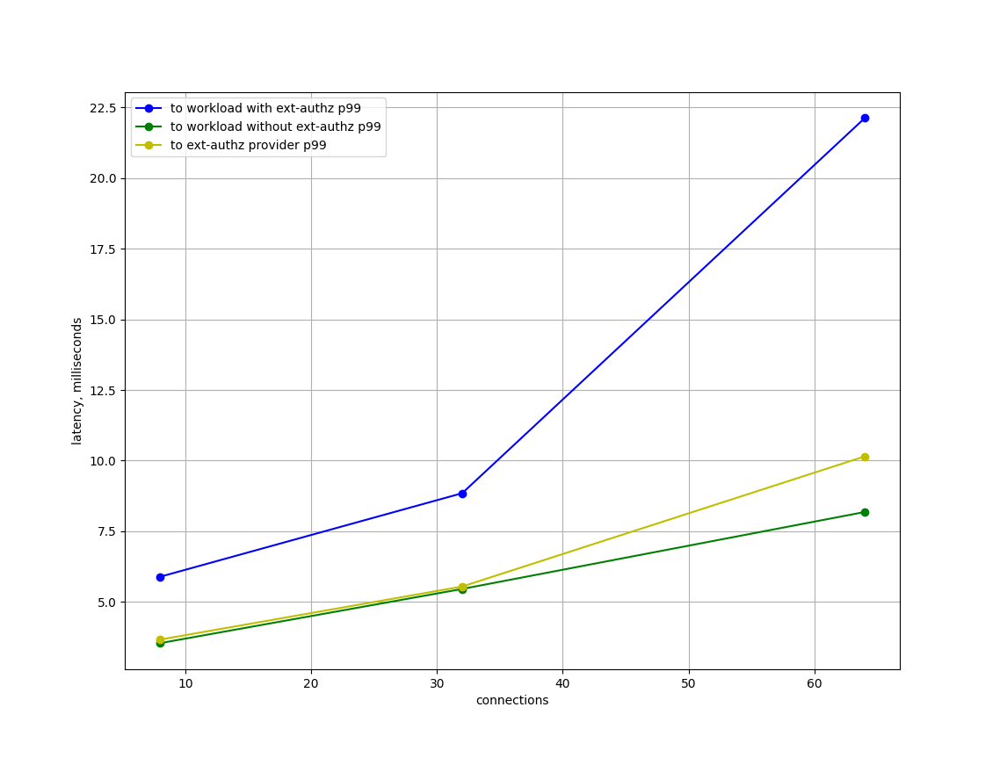
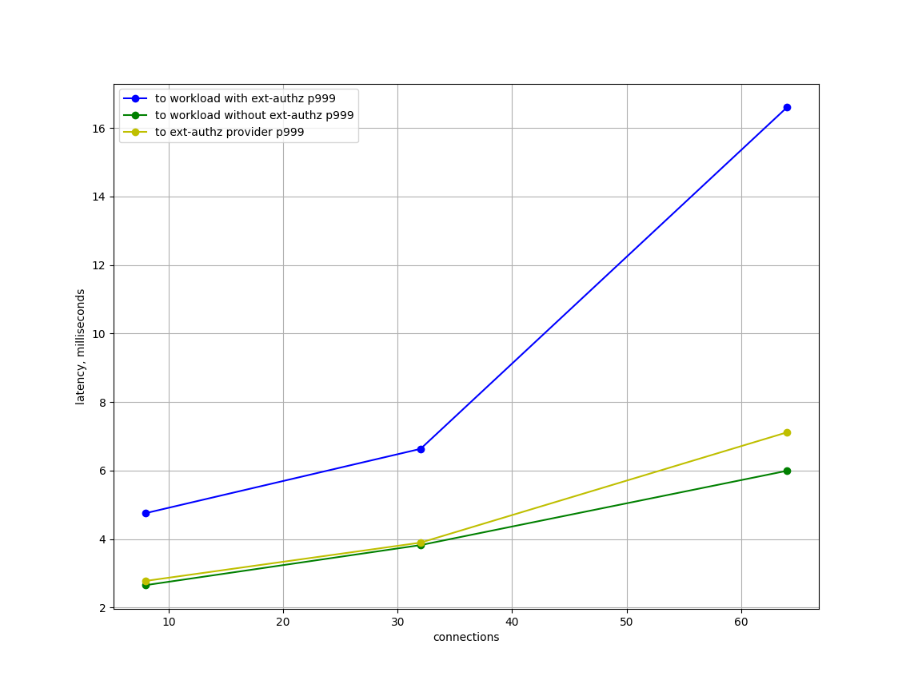

# Ext-authz Benchmarking

This directory contains scripts and configurations for ext-authz benchmarking.

## Prerequisites

See [Istio Performance Benchmarking](https://github.com/istio/tools/tree/master/perf/benchmark) for environment setup.

## Run the tests

To start the tests,

```bash
./run.sh
```

The command will setup ext-authz and start running tests.

## Results





## Analysis

- The y-axis is the latency, in milliseconds; and the x-axis is the number of concurrent connections.
- We analysis 3 different loads: small (qps=100, conn=8), medium (qps=500, conn=32), and large (qps=1000, conn=64) loads.
- The latency from client to workload **with** ext-authz is longer than the latency from client to workload **without** ext-authz.
- The increase of latency to workload with ext-authz is proportional to the increase of latency to provider.

In conclusion, the extra latency that ext-authz may introduce is related to the latency to ext-authz provider, and different kinds of provider may have different results.