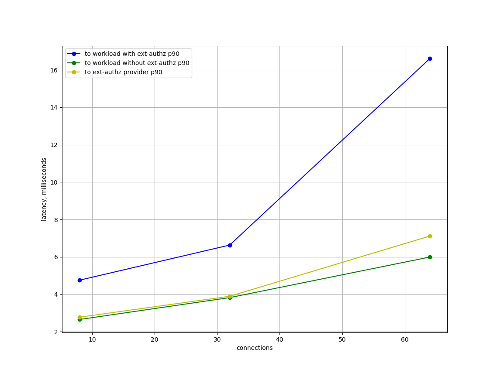

# Ext-authz Benchmarking

This directory contains scripts and configurations for ext-authz benchmarking.

## Prerequisites

See [Istio Performance Benchmarking](https://github.com/istio/tools/tree/master/perf/benchmark) for environment setup.

## Run the tests

To start the tests,

```bash
./run.sh
```

## Results

We draw 4 graphs: p50, p90, p99, and p999. p90 is the 90th percentile; and it means 90% of the observed requests have latency smaller or equal to the value. So on and so forth. The y-axis is the latency, in milliseconds; and the x-axis is the number of concurrent connections. We analysis 3 different loads: small (qps=100, conn=8), medium (qps=500, conn=32), and large (qps=1000, conn=64) loads.

### p50

 </br>
With the load increases, the latency also increases. Without ext-authz, the latency client-to-workload and client-to-provider are close. The latency is apparent higher with ext-authz.

### p90

 </br>
Similar with previous graph, the latency values increase when the load increases.

### p99

 </br>
The larger the p value is, the higher latency we can observe.

### p999

 </br>
Observing all graphs, the trend of client-to-workload with ext-authz is more similar to client-to-provider.

## Analysis

In conclusion, the extra latency that ext-authz may introduce is related to the latency to ext-authz provider, and different kinds of provider may have different results.
