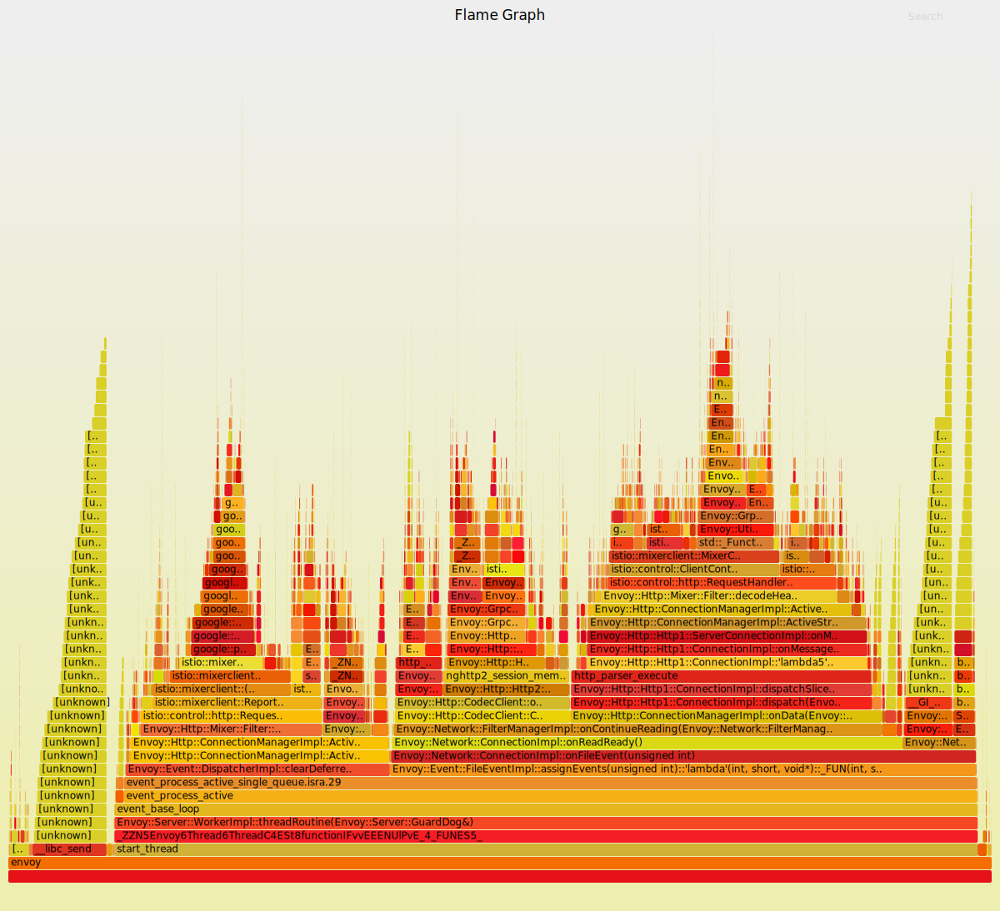

# Creating CPU flame graphs for Istio / Envoy



[Flame graph](http://www.brendangregg.com/perf.html#FlameGraphs) shows how much time was spent in a particular function.
1. The width of a stack element (flame) indicates the relative time spent in the function.
1. Call stacks are plotted vertically.
1. Colors are arbitrary.
1. Function names are sorted left to right.

This document shows how to gather performance data from within the `istio-proxy` container.

## Setup Perf tool (Envoy)

Flame graphs are created from data collected using linux `perf_events` by the `perf` tool.

1. Ensure that `perf` is installed within the container.
   Since `istio-proxy` container does not allow installation of new packages, build a new docker image.

    ```plain
    FROM gcr.io/istio-release/proxyv2:release-1.0-20180810-09-15
    # Install fpm tool
    RUN  sudo apt-get update && \
        sudo apt-get -qqy install linux-tools-generic
    ```

    Build image and push docker image and use it in your deployment by adding the following annotation.

    ```plain
    "sidecar.istio.io/proxyImag" : <name of your image>
    ```

    This step will go away once the default debug image contains `perf` and related tools.

1. Ensure that you can run `perf record`

    Running `perf record` from container requires the host to permit this activity. This is done by running the following command on the vm host.
    For example, if you are running on a GKE cluster, you should `ssh` to the node using the command:

    ```bash
    gcloud compute ssh gke-perf-test-default-pool-xxxxxx
    ```

    Then run the following command:

    ```bash
    sudo sysctl kernel.perf_event_paranoid=-1
    sudo sysctl kernel.kptr_restrict=0
    ```

    This setting is very permissive so it must be used with care.

    If running perf still gives error:```You may not have permission to collect stats. Consider tweaking /proc/sys/kernel/perf_event_paranoid:```
    after running above commands, try ssh into node and run the container with --privileged flag.

1. Run [`get_proxy_perf.sh`](get_proxy_perf.sh) to get the profiling svg. The following command collects samples at `99Hz` for `20s`. The svg file should be created under `flameoutput` dir

    ```plain
    ./get_proxy_perf.sh -p svc05-0-4-0-67bff5dbbf-grl94 -n service-graph05 -d 20 -f 99
    ...
    [ perf record: Woken up 1 times to write data ]
    [ perf record: Captured and wrote 0.061 MB /etc/istio/proxy/perf.data (74 samples) ]

    Wrote /etc/istio/proxy/perf.data.perf
    ...
    generating svg file svc05-0-7-564865d756-pvjhn-2020-01-29-22-34-19.perf
    ...
    ```

## Run pprof tool (istiod)

Flame graphs are created from data collected by pprof profiles

1. (Optional) Find the istiod pod you want to profile using kubectl and specify the pod and namesapce in the following command usting the `-p` and `-n` flags.
   By default, the first pod in istio-system with label `app=istiod` will be used.

1. Run [`get_istiod_pprof.sh`](get_istiod_pprof.sh) to generate the flame graph svg. The svg file should be created under `flameoutput` dir.
   The pod (-p) and namespace (-n) flags are optional. If omitted the first istiod pod in istio-system will be profiled.

    ```plain
    ./get_istiod_pprof.sh -p istiod-67bff5dbbf-grl94 -n istio-system -d 20
    Port forwarding debug port...
    ...
    Start profiling...
    ...
    Fetching profile over HTTP from http://127.0.0.1:8080/debug/pprof/profile?seconds=20
    Please wait... (20s)
    Handling connection for 8080
    ...
    Generating svg file istiod-85f8666f84-t524g_2020-06-18-09-45-39.pprof
    ...
    Wrote CPU flame graph istiod-85f8666f84-t524g_2020-06-18-09-45-39.svg
    ```
