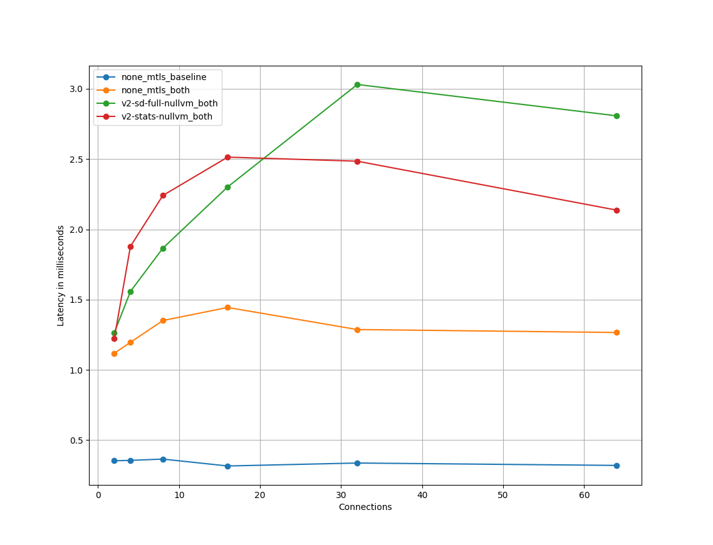

# Graph Plotter

[Graph Plotter](graph_plotter.py) is to help you visualize the CSV file you got from the
Istio performance benchmark.

## Usage and Example Plot

### Arguments

There are several required arguments that you need to specify:

```bash
--graph_type GRAPH_TYPE
Choose from one of them: [latency-p50, latency-p90, latency-p99, latency-p999, cpu-client, cpu-server, mem-client, mem-server].

--x_axis X_AXIS
Either qps or conn.

--telemetry_modes TELEMETRY_MODES
This is a list of perf test labels, currently it can be any combinations from the follow supported modes:
[none_mtls_baseline, none_mtls_both, v2-sd-full-nullvm_both, v2-stats-nullvm_both, v2-stats-wasm_both, v2-sd-nologging-nullvm_both].

--query_list QUERY_LIST
Specify the qps or conn range you want to plot based on the CSV file.
For example, conn_query_list=[2, 4, 8, 16, 32, 64], qps_query_list=[10, 100, 200, 400, 800, 1000].

--query_str QUERY_STR
Specify the qps or conn query_str that will be used to query your y-axis data based on the CSV file.
For example: conn_query_str=ActualQPS==1000, qps_query_str=NumThreads==16.

--csv_filepath CSV_FILEPATH
The path of the CSV file.

--graph_title GRAPH_TITLE
The graph title.                     
```

## Plotting

You can use the example [benchmark.csv](example_plot/benchmark.csv) file to plot a Latency-p50 vs. Connections graph use
the following command:

```bash
python3 ./graph_plotter.py --graph_type=latency-p50 --x_axis=conn --telemetry_modes=none_mtls_baseline,none_mtls_both,v2-sd-full-nullvm_both,v2-stats-nullvm_both --query_list=2,4,8,16,32,64 --query_str=ActualQPS==1000 --csv_filepath=./example_plot/benchmark.csv --fig_title=./example_plot/plotter_output.png
```

Example Output:

