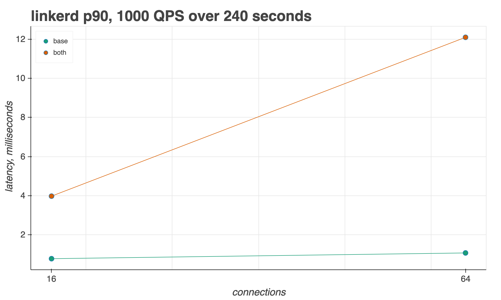
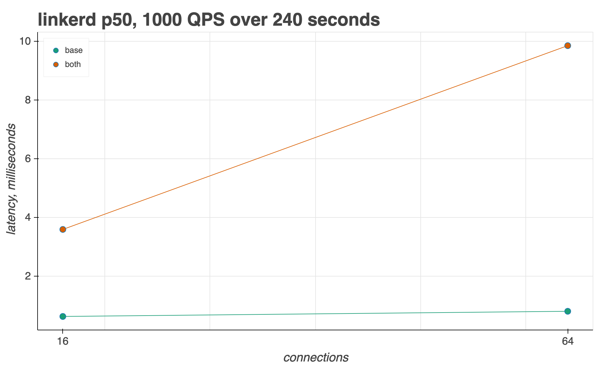

# Linkerd Benchmarking

In addition to a tuned Istio install, we also provide a Linkerd installation profile to run the same `../runner/` tests on.

Sources:

- <https://linkerd.io/2/getting-started/>
- <https://linkerd.io/2/reference/proxy-metrics/>

## 1 - Create cluster and Install Istio

Please follow this [Setup README](https://github.com/istio/tools/tree/release-1.7/perf/benchmark#setup), finish step 1.

## 2 - Install Linkerd

```bash
cd ../benchmark/linkerd
./setup_linkerd.sh <linkerd-release-version>
```

You can run the following command to see what components are installed

```bash
kubectl -n linkerd get deploy
```

## 3. Deploy the fortio test environment

```bash
export NAMESPACE=twopods-linkerd
export DNS_DOMAIN=local
export LINKERD_INJECT=enabled
cd ..
./setup_test.sh
```

## 4.Prepare Python Environment

Please follow steps here: [Prepare Python Env](https://github.com/istio/tools/tree/release-1.7/perf/benchmark#prepare-python-environment)

## 5. Run benchmark

Example:

```bash
python runner/runner.py 16,64 1000 240 --baseline --mesh=linkerd
```

## 6. Extract Fortio latency metrics to CSV

**Note** - Linkerd proxy CPU/memory usage not yet implemented, only latency performance.

```bash
export FORTIO_CLIENT_URL=<fortio client svc EXTERNAL_IP:port>

python runner/runner/fortio.py $FORTIO_CLIENT_URL
```

## 7. Visualize results

```bash
python ./runner/graph.py <PATH_TO_CSV> <METRIC> --mesh=linkerd
```

## Examples

### Latency, 90th percentile

```bash
python ./runner/graph.py linkerd.csv p90 --mesh=linkerd
```



### Latency, 50th percentile

```bash
python ./runner/graph.py linkerd.csv p50 --mesh=linkerd
```



See the [example-comparison](example-comparison/)
directory for a sample comparison between Istio and Linkerd from the perspective of Latency.

