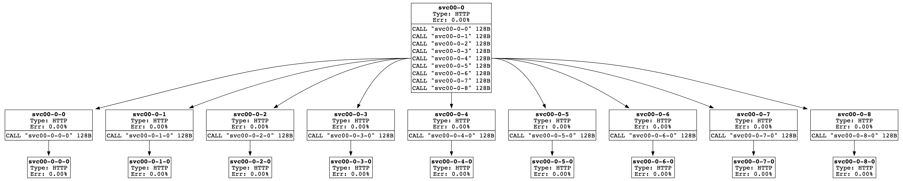

# Load Testing

This directory contains tools to generate large services to test Istio under heavy load.

## Service Graph

Service Graph provides a large tree of 20 services that will call each other, generated by [isotope](/isotope):

It will also set up an instance of [Fortio](https://github.com/fortio/fortio#fortio) to generate load.

## Setup

To setup a service graph, run `./setup_large_test.sh NUM`, where num is the number of instances to run.

Each instance will be created in a namespace `service-graph##`.

Each instance requests roughly 6 vCPUs and 6Gi of memory with Istio defaults.
