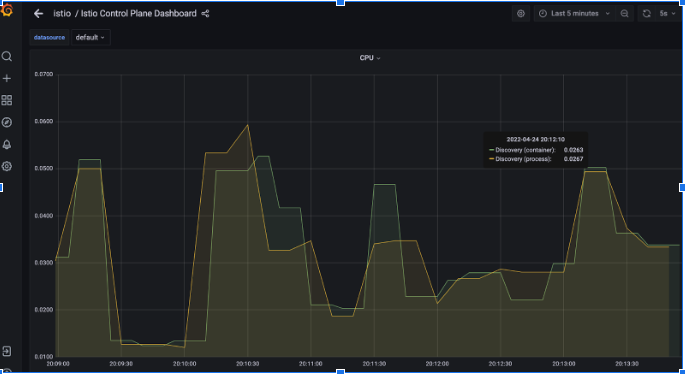
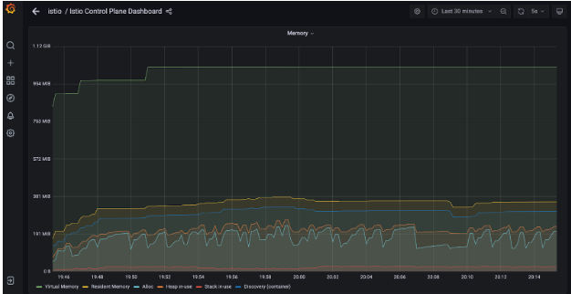
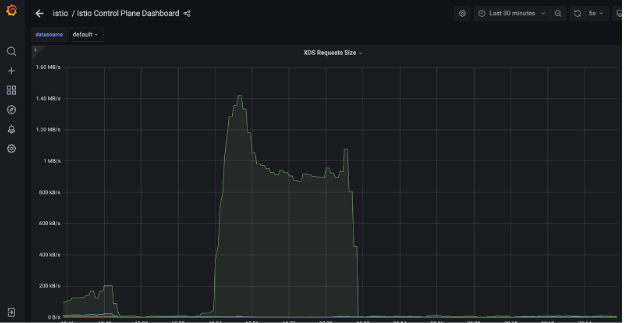

# Control Plane Testing

This directory tests the stability of istiod when security policies are deployed in bulk. The intent of this test is to analyse the cpu load and memory usage of istiod. The polices are being deployed in incremental manner where we initially deploy just 3 Authorization and Request Authentication Policies and later we deploy 100 of these policies and finally we deploy 1000 Authorization policies. Prometheus and Grafana is integrated to analyze the ups and down in cpu load and memory usage.

## Setup

1) First you need to setup the alertmanger, prometheus, grafana on your cluster which you can do by following this link - `https://github.com/istio/tools/tree/master/perf/stability#readme`

2) Run the following commands in different terminals.

    `istioctl dashboard prometheus -n istio-prometheus`

    `istioctl dashboard grafana -n istio-system`

3) Grafana dashboard is running on `localhost:3000`, you can check the istio-controlplane dashboard there to see the various metrics.

4) Run the following command to run the control plane tests.

```console
./test.sh
```

## Analysis

1) We are analysing 3 different metrics in this test : CPU Load, Memory Usage, XDS Request Size. The graphs which you need to check must be named as: CPU, Memory, XDS Requests Size.

2) CPU Load: It will increase whenever we add and delete the security policies. Istiod adds the policies and distributes the policies to envoy. So the CPU load will increase and while distributing the policies it will go little down and it will increase again while doing the same process again for the next batch of policies.



3) Memory Usage: Over the time when we add the policies the memory usage of control plane will go up, when we delete the policies it will go down. In the dashboard, you will see many different types of memories, you will need to focus on container memory.



4) xDS Request Size: When isitod distributes the policies to envoy, it uses the xDS transport portocol. So xDS request size will go up whenever istiod distributes policies to envoy. This can help us validate that istiod to envoy connection is fine.


