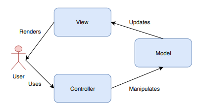

# Istio Performance Dashboard

## How to run this application locally

- Install Docker on your local machine.
    - [MacOS](https://docs.docker.com/docker-for-mac/install/)
    - [Ubuntu](https://docs.docker.com/install/linux/docker-ce/ubuntu/#os-requirements)
    - [Windows](https://docs.docker.com/docker-for-windows/install/)

- Make sure Docker compose installed on you local machine.
    - On Docker for Mac and Windows, Docker compose comes pre-installed. On Linux system, you need
    to install it directly from [here](https://github.com/docker/compose/releases).

- Then, cd to the root directory of istio performance dashboard, which should be `tools/perf_dashboard` and run

    ```bash
    docker-compose up
    ```

    to build and run the container. If your build is successful, open your browser, go to `localhost:8000` to access
    this application.

## Project Overview

### MVC Pattern

Basically, this Istio Performance Dashboard is built on top of Python Web [Django Framework](https://www.djangoproject.com/), which is a typical MVC pattern.



In Django, MVC is corresponding to:
- `models.py` file is the `model`
- `template` is the `view`
- `views.py` file is the `controller`

### Project Components

- The `perf_dashboard/perf_dashboard` repo contains all project-level settings, views and urls, which is using `perf_dashboard/templates` to render the home page.
- All there other sidebar sections you can see in this application is created by `python manage.py startapp [app_name]`. Like currently, we have the following apps:
    - benchmarks
    - configurations
    - regression_alerts
    - artifacts

